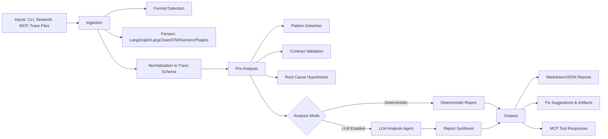

# Architecture

TraceAutopsy analyzes agent traces through a modular pipeline: ingest traces, detect deterministic failures, optionally run LLM synthesis, then output reports and fixes.

## System Diagram

## Notes

- Core execution path is deterministic-first; LLM analysis is optional and has fallback behavior.
- **Public API:** `src/agent_autopsy/api.py` is the supported facade for CLI, Streamlit, and MCP. Prefer importing `agent_autopsy.api` over deep imports from ingestion/preanalysis/analysis when adding entry points.
- **LLM agent:** LangGraph ReAct flow with an estimated **token budget** per run (`analysis_token_budget` in config, default 12k). Investigation stops early when the estimate exceeds the budget, then the graph routes to synthesis. **Report quality** is scored with deterministic checks (`ReportQualityValidator`); the agent may revise the draft up to `analysis_max_report_revisions` times until scores pass `analysis_report_quality_threshold` (default 0.65) or revisions are exhausted.
- **Semantic drift:** Goal-drift detection can use **sentence-transformers** embeddings when `semantic_drift_enabled` is on, a task goal exists, and embeddings are not skipped (`AUTOPSY_NO_EMBEDDINGS` / `--no-embeddings`). Otherwise the same detector uses lexical overlap only.
- **Plugins:** Parser and pattern plugins run in a sandboxed loop; failures are logged and skipped so one bad plugin does not block the pipeline.
- Advanced features include trace comparison, benchmark aggregation, and live monitoring alerts.
- Extensions are supported via plugin interfaces for parsers, detectors, reports, fix generation, and visualizations.

For detailed component descriptions, see [docs/architecture.md](docs/architecture.md).
