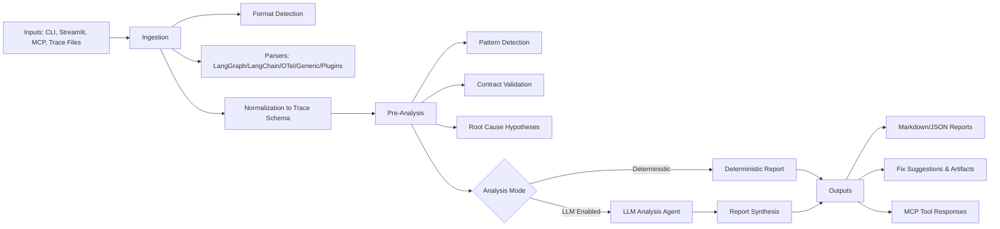

# Architecture

Agent Autopsy analyzes agent traces through a modular pipeline: ingest traces, detect deterministic failures, optionally run LLM synthesis, then output reports and fixes.

## System Diagram

## Notes

- Core execution path is deterministic-first; LLM analysis is optional and has fallback behavior.
- Advanced features include trace comparison, benchmark aggregation, and live monitoring alerts.
- Extensions are supported via plugin interfaces for parsers, detectors, reports, fix generation, and visualizations.

For detailed component descriptions, see [docs/architecture.md](docs/architecture.md).
