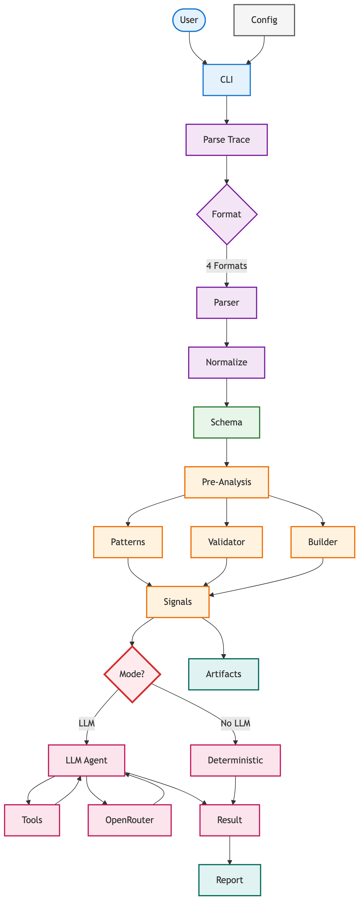

<div align="center">

# 🔬 Agent Autopsy

**Intelligent trace analysis for AI agents**

[](https://github.com/haseebraza715/agent-autopsy/blob/main/LICENSE)
[](https://github.com/haseebraza715/agent-autopsy)

*Automatically detect failures, loops, and issues in agent execution traces*

</div>

---

## ✨ Features

- **Multi-Format Support** — LangGraph, LangChain, OpenTelemetry, generic JSON
- **Pattern Detection** — Loops, error cascades, hallucinated tools, and more
- **LLM Analysis** — AI-powered root cause analysis with event citations
- **Report Generation** — Structured markdown reports with fix recommendations
- **Artifact Generation** — Code patches for retry policies, loop guards
- **Lightweight** — Minimal dependencies, fast analysis

---

## 🚀 Quick Start

```bash
# Install
pip install -r requirements.txt

# Configure
cp .env.example .env  # Add your OPENROUTER_API_KEY

# Analyze
python -m src.cli analyze trace.json
```

---

## 🔍 Detected Patterns

| Pattern | Severity | Description |
|---------|----------|-------------|
| Infinite Loop | 🔴 Critical | Same tool+input repeated 3+ times |
| Retry Storm | 🟠 High | Same tool called repeatedly |
| Context Overflow | 🔴 Critical | Token count exceeding limit |
| Hallucinated Tool | 🟠 High | Unknown tool called |
| Empty Response | 🟡 Medium | Empty LLM/tool output |
| Error Cascade | 🟠 High | Sequential error propagation |

---

## 💻 CLI Usage

```bash
# Full analysis
python -m src.cli analyze trace.json -o report.md

# Generate patches
python -m src.cli analyze trace.json --artifacts ./patches/

# Without LLM (deterministic only)
python -m src.cli analyze trace.json --no-llm

# Quick summary
python -m src.cli summary trace.json
```

**Options:**
| Flag | Description |
|------|-------------|
| `-o, --output` | Output file path |
| `--artifacts` | Patch output directory |
| `--model` | Model override |
| `-v, --verbose` | Detailed output |
| `--no-llm` | Skip LLM analysis |

---

## ⚙️ Configuration

```env
OPENROUTER_API_KEY=your_key_here
DEFAULT_MODEL=meta-llama/llama-3.1-8b-instruct
LOG_LEVEL=INFO
```

---

## 📁 Project Structure

```
agent-autopsy/
├── src/
│   ├── ingestion/    # Trace parsing
│   ├── preanalysis/  # Pattern detection
│   ├── analysis/     # LLM analysis
│   ├── output/       # Report generation
│   └── cli.py        # CLI interface
└── tests/
```

---

## 🏗️ Architecture



---

## 📚 Documentation

- [Architecture](docs/architecture.md) — System overview
- [Quick Start](docs/quickstart.md) — Installation guide
- [Ingestion](docs/ingestion.md) — Trace format support
- [Analysis](docs/analysis.md) — Pattern detection & LLM analysis
- [Patterns](docs/patterns.md) — Detected failure patterns
- [Output](docs/output.md) — Report generation

---

## 🤝 Contributing

PRs welcome! Feel free to submit issues or spread the word.

---

<div align="center">

MIT © [Haseeb Raza](https://github.com/haseebraza715)

</div>
