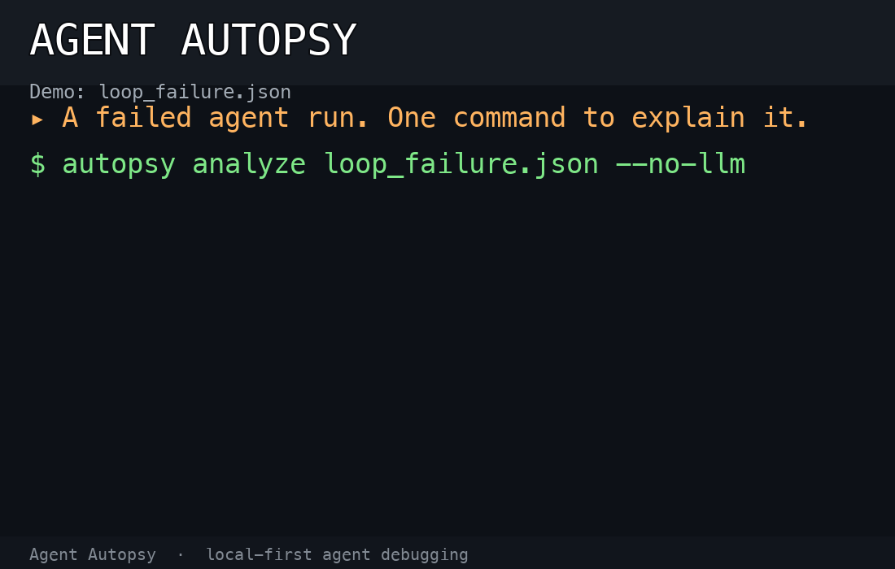

<div align="center">

# Agent Autopsy

### Forensic debugging for AI agent traces — in your terminal, in under a second.

[](LICENSE)
[](pyproject.toml)
[](https://github.com/haseebraza715/agent-autopsy)



**[Try it live →](https://autopsyagent.streamlit.app/)**

</div>

---

## The problem

Your agent failed. You have a 5 MB JSON trace. Now what?

`grep`ing won't surface the loop. The LangGraph Studio upload is slow and public-cloud. Your homegrown Python script catches the one bug you wrote it for and misses the next three.

## The fix

```bash
autopsy analyze trace.json
```

One second later, a terminal report shows you the infinite loop at event 42, the hallucinated tool call at event 58, and three retry storms between them — with citation event IDs you can jump to.

Want deeper analysis? Add `--stream` and an LLM synthesises root cause with cited evidence. Works with Ollama, OpenAI, Anthropic, OpenRouter.

---

## Quickstart

```bash
pip install -e ".[cli]"
autopsy analyze examples/traces/loop_failure.json --no-llm
```

No API key. No account. No network call. Works on your laptop, in CI, on air-gapped boxes.

---

---

## Documentation

- [Quickstart](docs/quickstart.md) · [Architecture](ARCHITECTURE.md) · [All docs](docs/)
