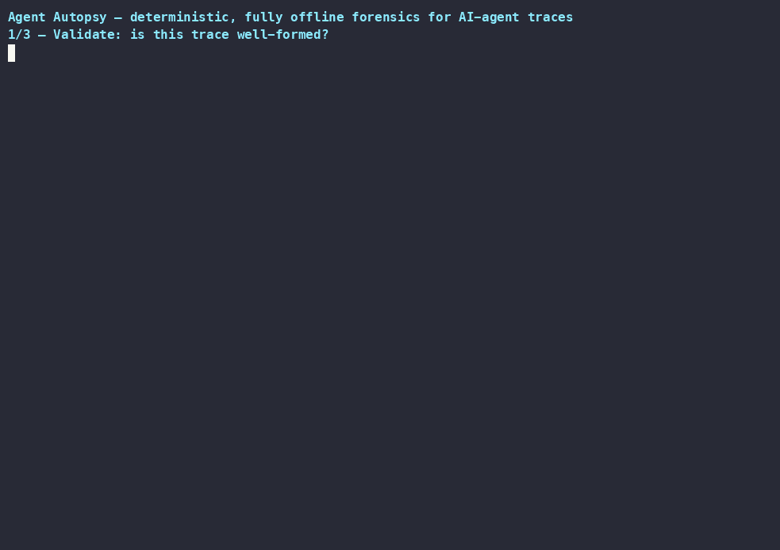

# TraceAutopsy

> Deterministic, fully offline forensics for AI-agent traces: detects loops, retry storms, and hallucinations without an LLM.

<p align="center"></p>

Watch the full demo: [demo.mp4](assets/demo/demo.mp4)

## Why this exists

Agent traces are huge, unstructured JSON blobs, and debugging a failed run means reading logs by hand or uploading the trace to a hosted dashboard. TraceAutopsy is a CLI that turns any trace file into a deterministic failure report with trace-backed evidence, and exits with a code CI can gate on.

## What it does

- **Ingests** LangGraph, LangChain, OpenTelemetry, and generic JSON traces into one event schema
- **Detects** failure patterns deterministically, offline: infinite loops, retry storms, empty responses, error cascades, hallucinated tools, timeouts, goal drift, stale context, and more
- **Reports** every finding with trace-backed evidence and a health score, as text, markdown, or JSON, and generates patch suggestions (error boundaries, prompt hardening) from them
- **Gates** with exit codes: `0` clean, `1` findings detected, `2` tool/parse error
- **Compares** any two runs with `autopsy diff` to prove a fix changed behavior

## Architecture

- `ingestion/parser.py` auto-detects the format and picks a parser (LangGraph, LangChain, OpenTelemetry, generic)
- `ingestion/normalizer.py` + `schema/trace_v2.py` map every format onto a single event model
- `preanalysis/patterns.py` runs the 12+ deterministic detectors (loops, retry storms, cascades, hallucinated tools, ...)
- `preanalysis/contracts.py` validates tool calls against the declared tool allow-list
- `output/` renders the report and generates fix suggestions
- `api.py` is the facade shared by the CLI, Streamlit UI, and MCP server

## Quick start

```bash
pip install -e ".[dev]"

autopsy validate examples/traces/hallucinated_tool.json
autopsy analyze examples/traces/hallucinated_tool.json
autopsy fixes examples/traces/hallucinated_tool.json
```

No API keys, network access, or model downloads are required. `examples/traces/` ships four traces: a clean run, a loop failure, the same loop after a fix, and a hallucinated-tool failure.

## Demo

```bash
bash scripts/demo/demo_body.sh    # run the live demo (takes ~30s, fully offline)
bash scripts/demo/record.sh       # regenerate the video/GIF assets (needs asciinema, agg, MEDIA_VENV)
```

The demo walks a broken trace through the pipeline: `validate` proves it is well-formed, `summary` shows the run stats, `analyze` emits a deterministic diagnosis (health score `24/100`, five findings including `hallucinated_tool`) and exits `1`, then `fixes` prints concrete patch suggestions.

## Technical decisions

- **Deterministic-first, LLM optional.** All detectors are pure functions over the event stream (`preanalysis/patterns.py`), so the core path needs no network and is reproducible. LLM root-cause narratives are an opt-in extra: the CLI falls back to deterministic mode when no API key is configured, so it never silently depends on a paid service.
- **One normalized event model for four formats.** Every parser emits the same `Trace`/`Event` schema, so all detectors, reports, and the diff engine work identically on traces from LangGraph, LangChain, OpenTelemetry, or arbitrary JSON, and a plugin can extend the set.
- **Retry-storm clustering uses a chained time window.** Each candidate event must fall within the window of the last event already in the cluster, so a long chain of retries spaced within the window is caught as one storm instead of being split below the detection threshold.
- **Atomic LLM-cache writes.** Cached analysis results are written to a `.tmp` file and renamed into place, so a crashed run never leaves a half-written cache entry that poisons later analyses.

## Validation

278 tests pass (`pytest`), and the same suite plus ruff and a labeled detector-corpus eval run in CI: 

## Limitations

- Deterministic detectors are heuristics, not proofs: they can produce false positives, and quiet failures can slip through; reports describe what the trace contains, so they cannot catch bugs that left no trace behind. A labeled corpus (`scripts/eval_detectors.py`) guards against regressions in CI.
- Goal-drift detection with semantic embeddings requires `sentence-transformers`, which downloads a model on first use; without it the same detector falls back to lexical overlap only.
- LLM-assisted analysis needs a provider API key and sends the normalized trace (not the raw file) to the model. The deterministic path never does.
- Built-in parsers cover the four common formats; anything else needs a plugin parser or the generic fallback, which may lose fidelity.
- Fix suggestions are templates and rationale, not auto-applied patches.
