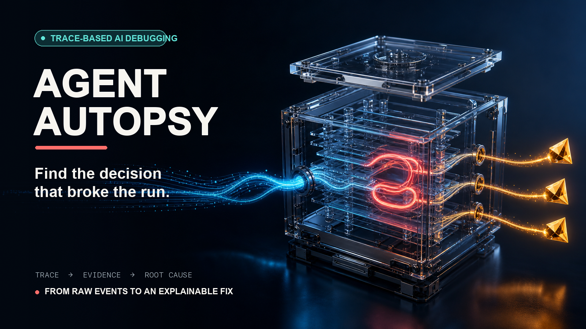
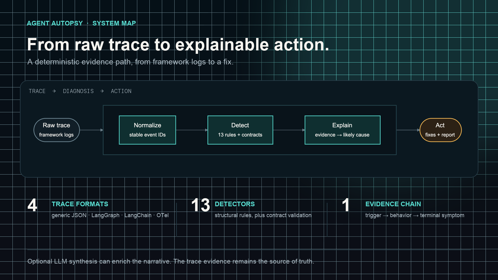
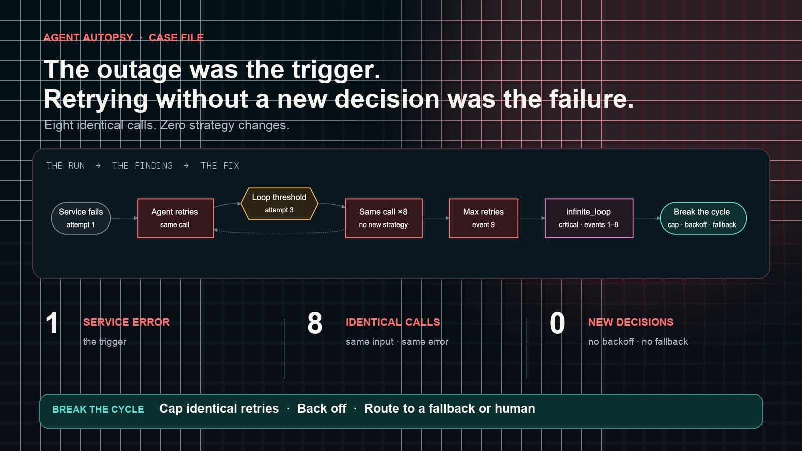
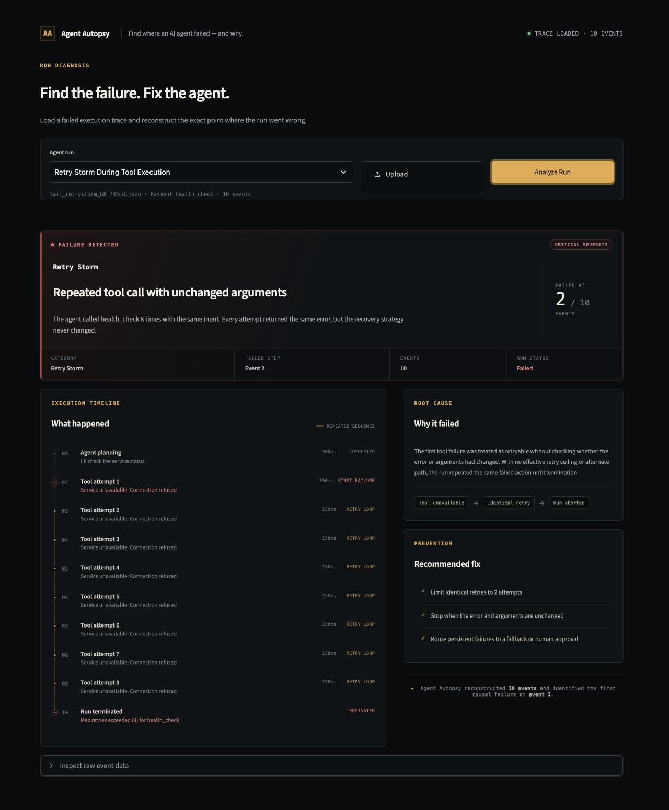

## title options

- inside Agent Autopsy: from raw traces to failure diagnosis
- building Agent Autopsy: debugging the decisions behind agent failures
- Agent Autopsy: finding where an agent run actually broke
- from execution logs to an agent failure timeline
- what i learned building a deterministic debugger for AI agents

selected: **inside Agent Autopsy: from raw traces to failure diagnosis**

---

# inside Agent Autopsy: from raw traces to failure diagnosis

A service outage should have produced one clear failure. Instead, this agent turned it into a broken trajectory.

The job was small: check the payment service. Event 0 makes the plan. Event 1 calls `health_check` and gets `Service unavailable: Connection refused`. The agent repeats the same call seven more times with the same arguments and the same result. Event 9 finally stops the run. Nothing changed except the retry count.

The trace recorded all of that, but a list of events is not an explanation. Agent Autopsy turns the list into a story: the first error is the trigger, the unchanged retries are the damaging behavior, and the final retry error is the symptom. It reconstructs a stable timeline, detects structural failure patterns, and produces evidence-linked causes and fixes. The default path is deterministic and local; an LLM is optional.

## the basic idea

Agent Autopsy treats diagnosis as a chain, not a dashboard. It first turns framework-specific logs into a stable timeline. It then finds structural failures, links them to the events that prove them, and turns that evidence into a likely cause and a concrete action.

## how the system is designed

Ingestion starts with format detection. The current adapters handle generic JSON, LangGraph, LangChain, and OpenTelemetry, with plugin parsers checked first. They map their source fields into Pydantic models for `Trace`, `TraceEvent`, environment data, task context, and aggregate statistics.

Normalization is deliberately small. It preserves the order produced by the parser, renumbers events sequentially, remaps parent references, fills missing timestamps from the previous known time, and recalculates tokens, latency, call counts, and error counts. It does not sort a questionable trace by timestamp and silently invent a new execution order. Stable IDs matter because every later claim points back to an event.

The deterministic layer currently runs 13 built-in detectors. They cover identical loops, time-window retry storms, redundant calls, empty outputs, error cascades, hallucinated tools, repeated authentication failures, timeouts, goal drift, stale context, token waste, inter-agent propagation, and context overflow. Contract validation is a separate pass for tool allow-lists, names, input and output shapes, and metadata.

That separation was useful. Structural failures such as three identical tool signatures do not need an LLM opinion. They need a reproducible rule and inspectable evidence. It also means the analyzer can run offline and behave consistently in a terminal or CI job.

`RootCauseBuilder` converts detector results and contract violations into signals, then maps them to hypothesis templates. Hypotheses have fixed confidence values and are sorted by confidence. The report generator builds a timeline, evidence set, likely causes, health score, and categorized fixes. These confidences are prioritization hints, not calibrated probabilities.

The optional LLM path receives the normalized trace and deterministic pre-analysis. It can query events, synthesize a richer narrative, and validate citations and a structured JSON appendix. If credentials are absent or the call fails, the system falls back to deterministic analysis. Diagnosis stays separate from presentation, so the same result can appear as Markdown, JSON, CLI output, Streamlit panels, or MCP data.

## one run, step by step

The bundled trace tells a simple story. One `health_check` returns a connection-refused error. Instead of changing its plan, the agent repeats exactly the same request, `{"service": "payment-service", "timeout": 1000}`, until the retry policy stops it at eight attempts. The outage is the trigger. Repetition without a new decision is the failure.

The identical-call detector uses a default threshold of three consecutive tool signatures. Structurally, that threshold is reached at internal event 3. Because analysis happens after the run, the detector scans the completed sequence and reports `infinite_loop`, critical severity, across events 1 through 8. The retry-storm detector does not emit a duplicate finding when those events are already owned by the identical loop. The same run also produces an `error_cascade` finding across events 1 through 9 and an `empty_response` finding for the eight failed tool calls, which have errors but no output value.

The deterministic CLI ranks “Missing exit condition in graph/router logic” first at its fixed 85 percent confidence, gives the run a health score of 34, and recommends iteration guards, an exit condition, early loop termination, and localized error handling. The focused demo presents the repeated failures as a “Retry Storm” and turns the evidence into three direct controls: limit identical retries to two, stop when error and arguments are unchanged, and route persistent failures to a fallback or human approval.

The UI is backed by the real parser and pre-analysis functions. Its visible “Event 2” is a one-based display label for internal `event_id` 1, the first failing tool call.

## what i tested

I ran the suite after the current package reorganization: 122 tests passed with one dependency deprecation warning. Ruff passed. Coverage includes all four ingestion fixtures, normalization, positive and clean detector cases, malformed input, reports, citation validation, trace capture and redaction, plugins, MCP services, comparison, monitoring, and the focused demo.

I also ran deterministic batch analysis over all 21 JSON traces in the labeled corpus. All 21 analyses completed and produced 38 signals in total. The three public example traces also completed, producing nine signals. The corpus evaluator met its configured precision and recall thresholds across the represented patterns. The corpus is hand-labeled per scenario with `must_not_include` negative controls (healthy slow calls, repeated successes, legitimate repeated queries, empty delete responses, benign timeout language), plus positive controls for retry storms, goal drift, stale context, and inter-agent failures.

Those numbers are regression results, not a scientific evaluation. The manifest is hand-specified per scenario, includes five `must_not_include` negative controls, four clean traces, and one excluded unlabeled failure entry (`skip_eval: true`), and is not an independently labeled external dataset. I did not test live provider calls in this pass.

## what it can and cannot do today

Today the project supports a Python API, a broad CLI, a multi-page Streamlit interface, a focused demo, and an MCP server. Trace-capture callbacks can write LangChain and LangGraph-style runs, while directory monitoring analyzes new files.

The main limits are equally concrete. This is primarily post-run diagnosis, not runtime control. Detectors are heuristics and can flag legitimate polling or intentional repetition. Hallucinated-tool detection needs a complete tool allow-list. Goal drift is lexical when embeddings are disabled or unavailable, and semantic mistakes can still look structurally valid. Recommendations and confidence values are pattern templates. The system can identify strong evidence around a failure, but it does not prove philosophical or counterfactual causality.

## what comes next

The next technical question is how much of this evidence can move into the execution loop. The same signatures used after a run could support duplicate-action guards, retry ceilings, exponential backoff, token and latency budgets, circuit breakers, tool permission checks, and approval gates. That work should keep the current property that makes the tool useful: every intervention must be explainable from the trace evidence that triggered it.

The takeaway is simple. Collecting every event is not the same as explaining a failed run. A useful debugger has to connect the trigger, the agent’s response, the repeated behavior, and the terminal symptom without hiding the underlying trace.

GitHub: https://github.com/haseebraza715/agent-autopsy

Demo: [insert X demo link]
