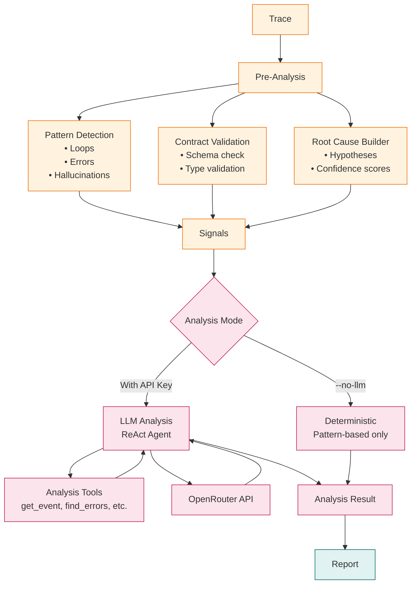

# Analysis Pipeline

Agent Autopsy uses deterministic pattern detection combined with LLM reasoning.

## Analysis Flow

## Pattern Detection

Detects common failure patterns:
- **Infinite Loops**: Same tool+input repeated 3+ times
- **Retry Storms**: Same tool with varying inputs
- **Error Cascades**: Sequential errors propagating
- **Hallucinated Tools**: Tools not in available list
- **Empty Responses**: Null/empty outputs
- **Context Overflow**: Token limits exceeded

## LLM Analysis

Uses LangGraph ReAct agent with:
- **Analysis Tools**: Query trace data
- **OpenRouter API**: LLM provider
- **Event Citations**: References specific events
- **Root Cause Chain**: Step-by-step analysis

