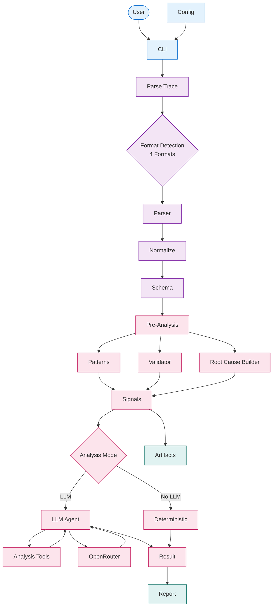

# Architecture Overview

Agent Autopsy analyzes agent execution traces to identify failures, loops, and issues.

## System Flow

## Components

- **CLI**: Command-line interface for user interaction
- **Ingestion**: Parse and normalize traces from multiple formats
- **Pre-Analysis**: Pattern detection and contract validation
- **Analysis**: LLM-powered root cause analysis
- **Output**: Generate reports and code artifacts

