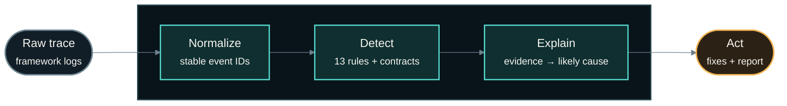
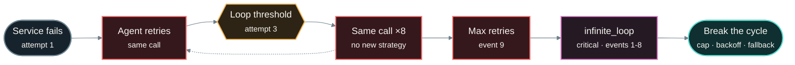

# Mermaid diagram sources

## From trace to diagnosis

```mermaid
%%{init: {"theme":"base","flowchart":{"curve":"basis","nodeSpacing":42,"rankSpacing":70,"htmlLabels":true},"themeVariables":{"fontFamily":"Arial, sans-serif","fontSize":"18px","lineColor":"#6c7f8a","clusterBkg":"#0c1720","clusterBorder":"#25414c","primaryTextColor":"#f7f5f0"}}}%%
flowchart LR
    A(["Raw trace<br/><small>framework logs</small>"])

    subgraph AA[" "]
        direction LR
        B["Normalize<br/><small>stable event IDs</small>"]
        C["Detect<br/><small>13 rules + contracts</small>"]
        D["Explain<br/><small>evidence → likely cause</small>"]
        B --> C --> D
    end

    E(["Act<br/><small>fixes + report</small>"])
    A --> B
    D --> E

    classDef edge fill:#111e27,stroke:#6d8591,color:#f7f5f0,stroke-width:2px;
    classDef core fill:#0f2f30,stroke:#55d6ca,color:#f7f5f0,stroke-width:2px;
    classDef output fill:#2c2115,stroke:#f1b453,color:#f7f5f0,stroke-width:2px;
    class A edge;
    class B,C,D core;
    class E output;
    style AA fill:#09131a,stroke:#24424b,stroke-width:2px
```

## How the retry became the failure

```mermaid
%%{init: {"theme":"base","flowchart":{"curve":"basis","nodeSpacing":38,"rankSpacing":60,"htmlLabels":true},"themeVariables":{"fontFamily":"Arial, sans-serif","fontSize":"18px","lineColor":"#6c7f8a","primaryTextColor":"#f7f5f0"}}}%%
flowchart LR
    A(["Service fails<br/><small>attempt 1</small>"])
    B["Agent retries<br/><small>same call</small>"]
    C{{"Loop threshold<br/><small>attempt 3</small>"}}
    D["Same call ×8<br/><small>no new strategy</small>"]
    E["Max retries<br/><small>event 9</small>"]
    F["infinite_loop<br/><small>critical · events 1-8</small>"]
    G(["Break the cycle<br/><small>cap · backoff · fallback</small>"])

    A --> B --> C --> D --> E --> F --> G
    D -.-> B

    classDef trigger fill:#17232c,stroke:#6d8591,color:#f7f5f0,stroke-width:2px;
    classDef threshold fill:#2d2415,stroke:#f1b453,color:#f7f5f0,stroke-width:2px;
    classDef failure fill:#35181c,stroke:#ff716e,color:#f7f5f0,stroke-width:2px;
    classDef finding fill:#251a24,stroke:#dd7cc7,color:#f7f5f0,stroke-width:2px;
    classDef action fill:#0f2f30,stroke:#55d6ca,color:#f7f5f0,stroke-width:2px;
    class A trigger;
    class B,D,E failure;
    class C threshold;
    class F finding;
    class G action;
```
