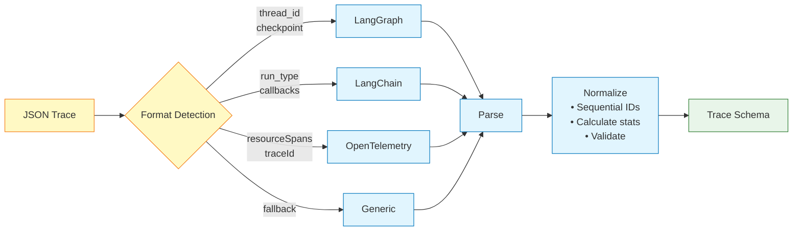

# Trace Ingestion

Agent Autopsy supports multiple trace formats with automatic detection.

## Format Detection

## Supported Formats

1. **LangGraph**: Detects `thread_id`, `checkpoint`, or `runs` fields
2. **LangChain**: Detects `run_type` or `callbacks` fields
3. **OpenTelemetry**: Detects `resourceSpans` or `traceId` fields
4. **Generic**: Fallback for any JSON structure

## Normalization

- Ensures sequential event IDs
- Calculates statistics (tokens, latency, counts)
- Validates structure and references
- Fills missing timestamps

