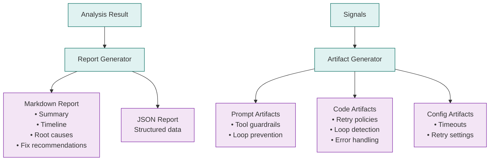

# Output Generation

Agent Autopsy generates structured reports and actionable code artifacts.

## Output Flow

## Report Structure

1. **Summary**: Status, confidence, brief description
2. **Timeline**: Key events from start to failure
3. **Root Cause Chain**: Step-by-step analysis with event citations
4. **Fix Recommendations**: 
   - A) Graph/Code fixes
   - B) Tool contract fixes
   - C) Prompt/policy fixes
   - D) Ops fixes
5. **Evidence**: Cited event IDs and supporting data

## Artifacts

Generated code patches include:
- **Prompt Updates**: System prompt additions
- **Code Snippets**: Retry logic, loop detection, error handling
- **Config Files**: Timeout and retry configurations

