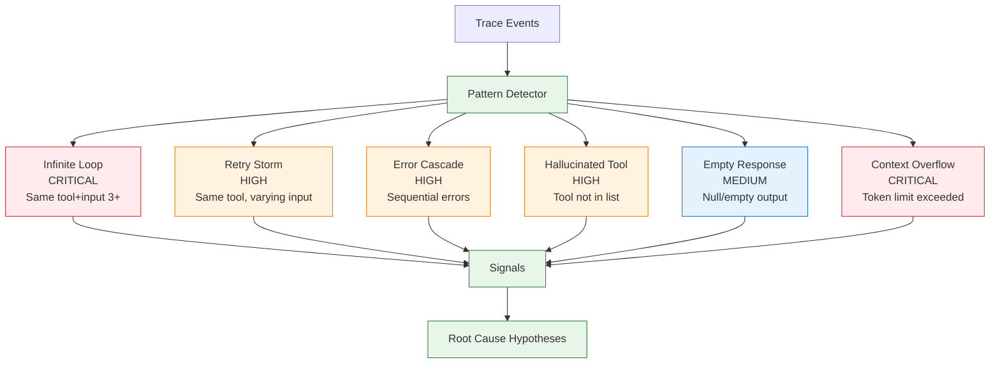

# Pattern Detection

Agent Autopsy automatically detects common failure patterns in agent traces.

## Pattern Types

## Detection Methods

- **Infinite Loop**: Tracks tool signatures (name + input hash)
- **Retry Storm**: Detects repeated tool calls with variations
- **Error Cascade**: Identifies sequential error events
- **Hallucinated Tool**: Validates against available tools list
- **Empty Response**: Checks for null/empty outputs
- **Context Overflow**: Compares token count to model limits

## Severity Levels

- **CRITICAL**: Infinite loops, context overflow
- **HIGH**: Retry storms, error cascades, hallucinated tools
- **MEDIUM**: Empty responses
- **LOW**: Minor issues

