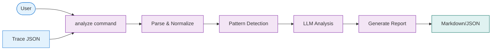

# Quick Start Guide

Get started with Agent Autopsy in minutes.

## Installation

```bash
# Create virtual environment
python -m venv venv
source venv/bin/activate

# Install dependencies
pip install -r requirements.txt

# Configure environment
cp .env.example .env
# Edit .env with your OPENROUTER_API_KEY
```

## Basic Usage



## Commands

```bash
# Analyze a trace
python -m src.cli analyze trace.json

# Save report to file
python -m src.cli analyze trace.json -o report.md

# Generate artifacts
python -m src.cli analyze trace.json --artifacts ./patches/

# Run without LLM
python -m src.cli analyze trace.json --no-llm

# Quick summary
python -m src.cli summary trace.json

# Validate format
python -m src.cli validate trace.json
```

## Example Workflow

1. **Collect trace**: Export trace from your agent framework
2. **Analyze**: Run `analyze` command on trace file
3. **Review report**: Check root cause analysis and recommendations
4. **Apply fixes**: Use generated artifacts to fix issues

